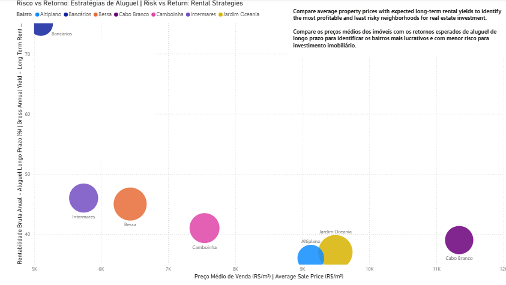
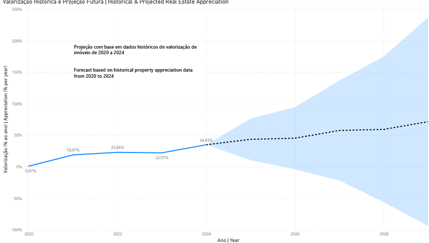

# 📊 João Pessoa Real Estate Insights

An in-depth, data-driven visual analysis of João Pessoa’s real estate market, combining quality of life indicators, rental investment risks, and predictive appreciation trends.

> Uma análise visual e orientada por dados sobre o mercado imobiliário de João Pessoa, combinando qualidade de vida, estratégias de aluguel e projeções de valorização.

---

## 🔍 1. Quality of Life Index by Neighborhood | Índice de Qualidade de Vida por Bairro

Visualize neighborhood-level differences in quality of life across João Pessoa. This index combines factors such as safety, health services, transport connectivity, and access to leisure areas.

> Visualize diferenças na qualidade de vida entre bairros de João Pessoa. Este índice combina fatores como segurança, acesso à saúde, transporte público e lazer.

---

## 📉 2. Risk vs Return: Rental Strategies | Risco vs Retorno: Estratégias de Aluguel

Compare expected long-term rental yield and average sale price per square meter to identify which neighborhoods offer the best rental ROI and lowest investment risk.

> Compare retorno de aluguel de longo prazo e preço médio por m² para identificar bairros com melhor ROI e menor risco para investimento.

---

## 📈 3. Historical & Projected Real Estate Appreciation | Valorização Histórica e Projeção Imobiliária

Forecast based on historical appreciation rates from 2020 to 2024, projecting growth through 2029 with a confidence interval.

> Projeção baseada na valorização de imóveis entre 2020 e 2024, com estimativa de crescimento até 2029 e faixa de confiança.

---

## 🚀 Technologies Used | Tecnologias Utilizadas

- Microsoft Power BI
- DAX & Forecast analytics
- Public real estate and urban data

---

## 👨‍💻 Author

Diego Porto  
[🔗 GitHub](https://github.com/diegoporto10)  

